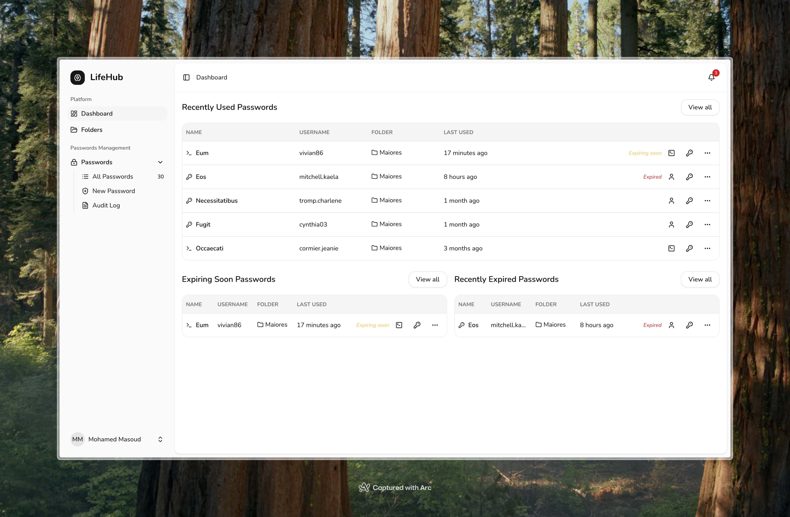
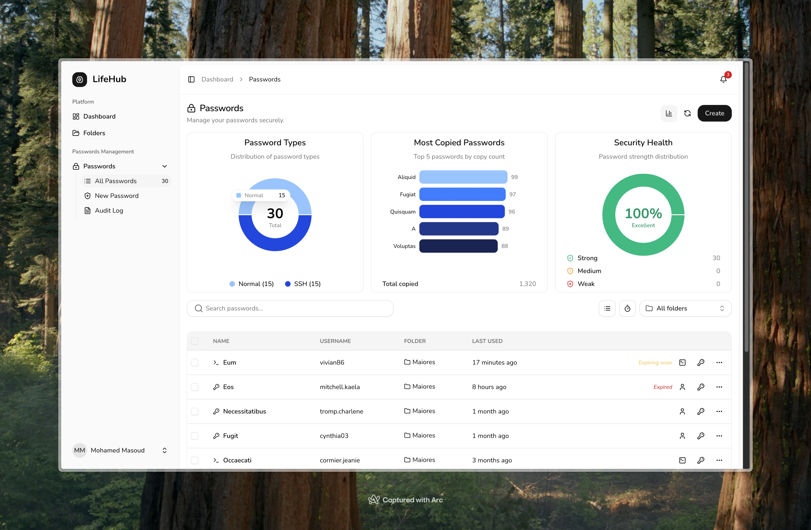
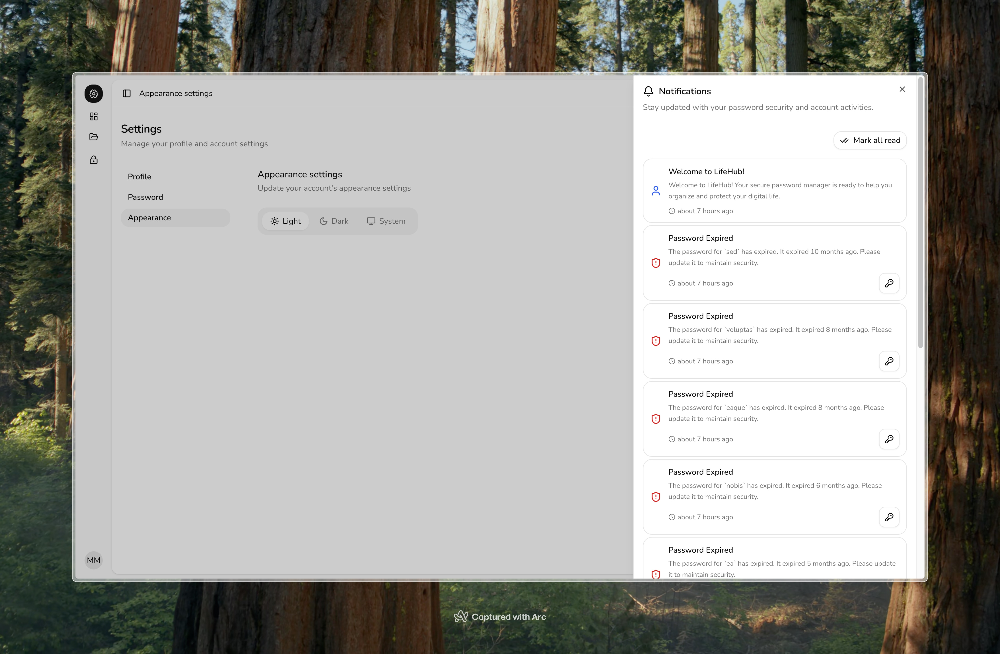
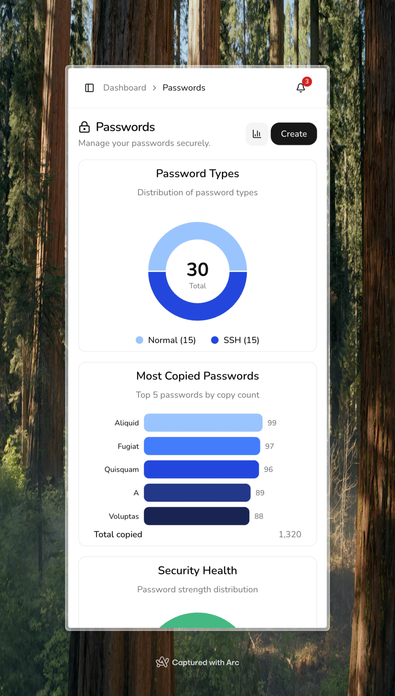
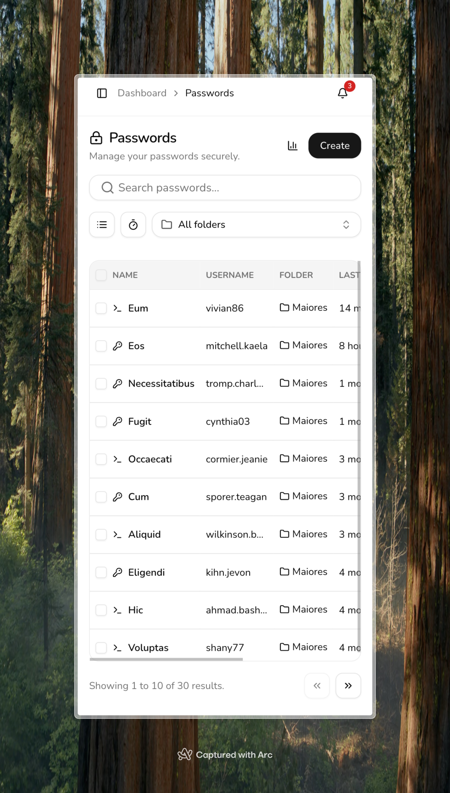
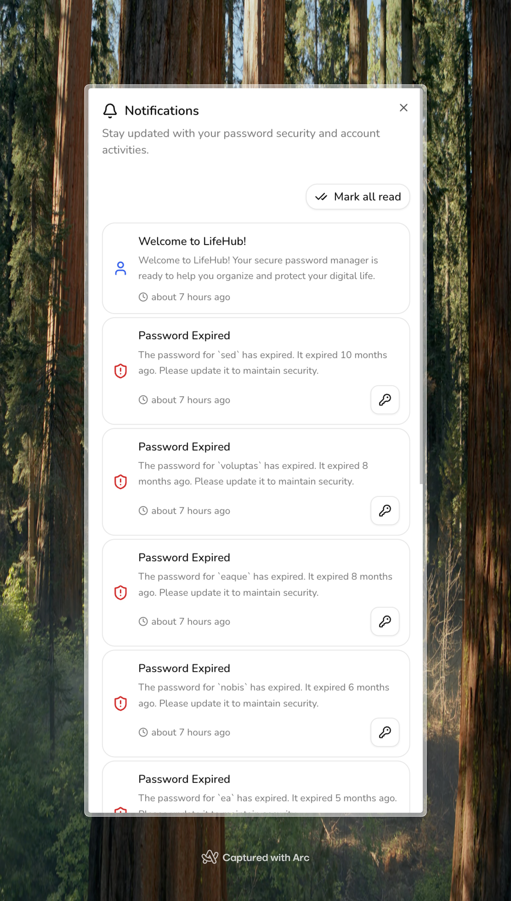

# LifeHub 🔐

**A secure, modern password management application built with Laravel and React**

---

## 📖 Description

LifeHub is a comprehensive password management solution designed for individuals and teams who prioritize security and organization. Built with enterprise-grade encryption and a modern user interface, LifeHub provides a secure vault for storing passwords, SSH keys, and other sensitive credentials with advanced features like expiration tracking, audit logging, and intelligent organization.

The application features envelope encryption for maximum security, intuitive folder organization, and a powerful dashboard that helps users maintain good password hygiene by tracking recently used, expiring, and expired credentials. With its clean, responsive design and robust feature set, LifeHub makes password management both secure and user-friendly.

---

## 🛠️ Tech Stack

### Backend

- **Laravel 12** - Modern PHP framework with robust security features
- **PHP 8.2** - Latest PHP version with enhanced performance
- **Laravel Sanctum** - API authentication and SPA authentication
- **Inertia.js** - Modern monolith approach connecting Laravel and React

### Frontend

- **React 19** - Latest React with modern hooks and concurrent features
- **TypeScript** - Type-safe JavaScript for better development experience
- **Tailwind CSS 4** - Utility-first CSS framework for rapid UI development
- **Radix UI** - Unstyled, accessible UI components
- **Vite** - Fast build tool and development server

### Development & Testing

- **Pest** - Elegant PHP testing framework
- **Vitest** - Fast unit testing for JavaScript/TypeScript
- **ESLint** - Code linting and style enforcement
- **Prettier** - Code formatting
- **Laravel Pint** - PHP code style fixer

### Security

- **Envelope Encryption** - Multi-layer encryption for maximum security
- **Password Strength Analysis** - Built-in password strength calculator
- **Audit Logging** - Comprehensive activity tracking

---

## ✨ Key Features

- 🔒 **Enterprise-Grade Security**

    - Envelope encryption for passwords and sensitive data
    - Secure key management with versioning
    - Password strength analysis and recommendations

- 📁 **Smart Organization**

    - Folder-based organization system
    - Featured folders for quick access
    - Automatic sorting by usage and relevance

- ⏰ **Expiration Management**

    - Password expiration tracking
    - Proactive notifications for expiring passwords
    - Dashboard alerts for expired credentials

- 🖥️ **Multi-Credential Support**

    - Standard password storage
    - SSH key management with CLI commands
    - Custom fields for URLs and notes

- 📊 **Comprehensive Dashboard**

    - Recently used passwords
    - Expiring password alerts
    - Expired password tracking
    - Usage statistics and insights

- 🔍 **Advanced Search & Filtering**

    - Search across all stored credentials
    - Filter by type, folder, and expiration status
    - Sort by usage, date, and relevance

- 📈 **Audit & Analytics**

    - Detailed audit logs for all activities
    - Usage tracking and copy statistics
    - Security event monitoring

- 🎨 **Modern UI/UX**
    - Responsive design for all devices
    - Dark mode support
    - Intuitive navigation and workflow
    - Accessible components with keyboard support

---

## 🚀 Setup Instructions

### Prerequisites

- PHP 8.2 or higher
- Node.js 18+ and npm
- Composer
- SQLite/MySQL/PostgreSQL

### 1. Clone the Repository

```bash
git clone <repository-url>
cd lifehub
```

### 2. Install Dependencies

```bash
# Install PHP dependencies
composer install

# Install Node.js dependencies
npm install
```

### 3. Environment Configuration

```bash
# Copy environment file
cp .env.example .env

# Generate application key
php artisan key:generate
```

### 4. Database Setup

```bash
# Create SQLite database (default)
touch database/database.sqlite

# Run migrations
php artisan migrate

# (Optional) Seed sample data
php artisan db:seed
```

### 5. Build Frontend Assets

```bash
# For development
npm run dev

# For production
npm run build
```

### 6. Start Development Server

```bash
# Option 1: Use the built-in dev command (includes all services)
composer run dev

# Option 2: Start services individually
php artisan serve
```

### 7. Access the Application

Open your browser and navigate to:

- **Development**: `http://localhost:8000`
- **API Documentation**: `http://localhost:8000/api/documentation` (if available)

---

## 📸 Screenshots

### Desktop Views

#### Dashboard



#### Password Management



#### Appearance Settings



### Mobile Views

#### Password Management





#### Notifications



---

## 📚 Documentation

For detailed technical information and development guidelines, please refer to our comprehensive documentation:

- **[Technical Documentation](docs/LIFEHUB_TECHNICAL_DOCUMENTATION.md)** - Complete technical overview, architecture, and implementation details
- **[Frontend Testing Guide](docs/FRONTEND_TESTING_GUIDE.md)** - Testing strategies, patterns, and best practices for the frontend
- **[Frontend Coding Standards](docs/FRONTEND_CODING_STANDARDS.md)** - Code style guidelines and conventions for React/TypeScript
- **[Components Guidelines](docs/COMPONENTS_GUIDELINES.md)** - UI component development standards and patterns

---

## 🧪 Testing

Run the test suite to ensure everything is working correctly:

```bash
# PHP tests
php artisan test

# JavaScript/TypeScript tests
npm run test

# Run tests with coverage
npm run test:coverage
```

## 📝 Development Commands

```bash
# Code formatting
npm run format
composer run pint

# Type checking
npm run types

# Linting
npm run lint

# Build for production
npm run build

# Start development with all services
composer run dev
```

## 🔒 Security

LifeHub implements multiple security layers:

- **Envelope Encryption**: All sensitive data is encrypted using industry-standard encryption
- **Key Versioning**: Supports key rotation without data loss
- **Audit Logging**: Complete activity tracking for security monitoring
- **Secure Authentication**: Laravel Sanctum with CSRF protection

## 📄 License

This project is licensed under the MIT License - see the LICENSE file for details.

---

## 🤝 Contributing

Contributions are welcome! Please feel free to submit a Pull Request.

## 📧 Support

For support, please open an issue in the GitHub repository or contact the development team.

---

_Built with ❤️ using Laravel and React_
